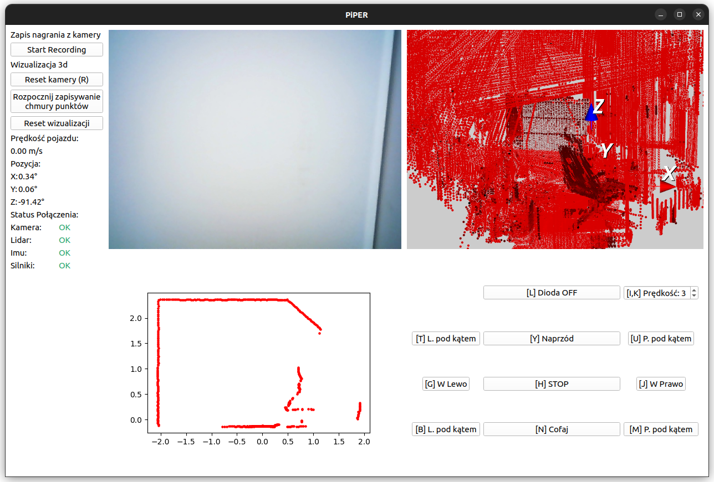

# Preview



# Download

First, install the required programs (Ros2 humble, etc.).

Then download the repository:

```
cd Desktop/

git clone https://github.com/Dezinter8/Piper_Gui.git
```

To install the application, it is best to create a virtual environment (venv) using programs such as pycharm or directly from the console using the command:

```
cd Piper_Gui/

virtualenv venv

source venv/bin/activate
```

To download the required libraries, use the command:

```
pip install PyQt5 vtk==9.2.6 opencv-python-headless filterpy
```

To run the program, use the command:

```
python main.py
```

# Branches

Branch main is for simulation support

Branch Piper_bot is for handling the physical robot

```
git checkout Piper_bot
```

# Building Ui

mainwindow ui - You can run it in Qt Designer and edit it directly there. After editing, execute the command:

```
pyuic5 mainwindow.ui -o MainWindow.py
```

resources qrc - This is a file containing resources such as icons or photos. To convert it to a py file, use the command:

```
pyrcc5 resources.qrc -o resources_rc.py
```
